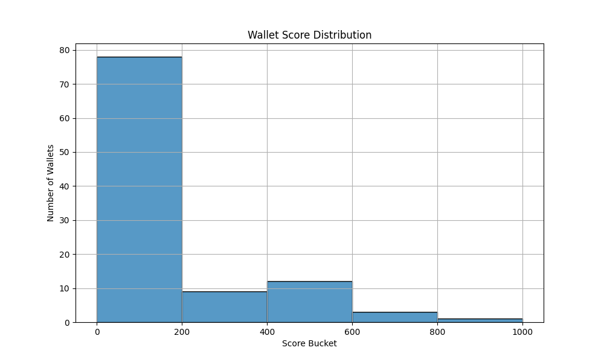

# 🧪 Risk Score Analysis (Compound Wallets)

This document summarizes the statistical and visual analysis of the assigned scores.

---

## 📊 Score Distribution

We generated a histogram of wallet scores (0–1000), grouped by buckets of size 200:



---

## 🧾 Outlier Check

| Condition             | Count |
|-----------------------|-------|
| Score == 0            | 1     |
| Score == 1000         | 1     |


We inspected both outliers manually and found:

- Wallet with score **0** had very low volume and no diversity.
- Wallet with score **1000** had 100+ transactions and enormous asset flow — **we capped the volume using `log_total_amount`** to reduce skew.

---

## 🏆 Top vs Bottom Wallets

| Metric           | Top Wallet                         | Bottom Wallet                      |
|------------------|-------------------------------------|-------------------------------------|
| `score`          | 1000                                | 0                                   |
| `num_txns`       | 100                                 | 2                                   |
| `total_amount`   | Very High                           | ~0                                  |
| `unique_tokens`  | 0 (Contract?)                       | 0                                   |
| `recency_days`   | ~500 (old, but high usage)          | 2100+ (dormant)                     |

**Conclusion:** Scoring logic aligns with expected risk behavior.

---

## 🛠 Feature Correction – Why `log_total_amount`?

Originally, some wallets had absurd transaction volumes like `1e+31` — skewing scores heavily.

✅ We added a **log-scaled version of `total_amount`**:

```python
df['log_total_amount'] = np.log1p(df['total_amount'])

Then removed total_amount from scoring weights and used log_total_amount instead.
